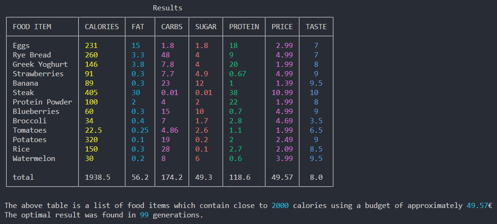

# GENETIC ALGORITHM FOR OPTIMAL MEAL CHOICE

### The algorithm returns a list of food items that best fits the user's budget based on the user's preferred nutrient and its goal intake amount

## SETUP

### Setup a Python environment inside a code editor like VSCode, open the terminal & use the following commands to finish setup:

- use `python get-pip.py` to install **pip (Preferred Installer Program)** for Python
- use `python -m pip install --upgrade pip` to upgrade pip
- use `pip install collections enum functools rich` to install all necessary Python libraries
- use `python algorithm.py` to run the script

## USER INPUT
- nutrient (calories/fat/protein/carbs/sugar)
- goal nutrient intake (cal/g)
- budget (€)
- initial population size
- maximum number of generations

## RESULTS
- table of food items with their corresponding nutritional values, prices & a biased taste assessments :)

