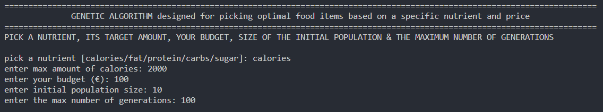

# GENETIC ALGORITHM FOR OPTIMAL MEAL CHOICE

### The algorithm returns a list of food items that best fits the user's budget based on the user's preferred nutrient and its goal intake amount

## SETUP

### Setup a Python environment inside a code editor like VSCode, open the terminal & use the following commands to finish setup:

- use `python get-pip.py` to install **pip (Preferred Installer Program)** for Python
- use `python -m pip install --upgrade pip` to upgrade pip
- use `pip install collections enum functools rich` to install all necessary Python libraries
- use `python algorithm.py` to run the script


## USER INPUT
- nutrient (calories/fat/protein/carbs/sugar)
- goal nutrient intake (cal/g)
- budget (€)
- initial population size
- maximum number of generations



## AVAILABLE FOOD ITEMS

```py
Food = namedtuple("Food", ["name", "calories", "fat", "protein", "carbs", "sugar", "price", "taste"])

# the numbers inside the Food objects correspond to the nutrients listed above in the Food type declaration
foods = [
    Food("Eggs          ", 231, 15, 18, 1.8, 1.8, 2.99, 7),
    Food("Chicken Breast", 165, 3.6, 31, 0.01, 0.01, 1.99, 8),
    Food("Rye Bread     ", 260, 3.3, 9, 48, 4, 4.99, 7),
    Food("Butter        ", 717, 81, 0.9, 0.1, 0.1, 5.99, 8),
    Food("Milk Chocolate", 535, 30, 8, 59, 52, 2.49, 9),
    Food("Honey         ", 304, 0.01, 0.3, 82, 82, 4.49, 8.5),
    Food("Milk          ", 149, 8, 8, 12, 12, 1.59, 6),
    Food("Greek Yoghurt ", 146, 3.8, 20, 7.8, 4, 1.99, 8),
    Food("Strawberries  ", 91, 0.3, 0.67, 7.7, 4.9, 4.99, 9),
    Food("Banana        ", 89, 0.3, 1, 23, 12, 1.39, 9.5),
    Food("Apple         ", 52, 0.2, 0.3, 14, 10, 1.29, 7),
    Food("Pecan Nuts    ", 400, 40, 5, 8, 2, 5.99, 6),
    Food("Steak         ", 405, 30, 38, 0.01, 0.01, 10.99, 10),
    Food("Protein Powder", 100, 2, 22, 4, 2, 1.99, 8),
    Food("Protein Yogurt", 180, 1, 20, 6, 4, 1.29, 8.5),
    Food("Blueberries   ", 60, 0.3, 0.7, 15, 10, 4.99, 9),
    Food("Almonds       ", 580, 50, 21, 21.55, 4.35, 4.79, 5.5),
    Food("Broccoli      ", 34, 0.4, 2.8, 7, 1.7, 4.69, 3.5),
    Food("Tomatoes      ", 22.5, 0.25, 1.1, 4.86, 2.6, 1.99, 6.5),
    Food("Potatoes      ", 320, 0.1, 2, 19, 0.2, 2.49, 9),
    Food("Rice          ", 150, 0.3, 2.7, 28, 0.1, 2.09, 8.5),
    Food("Watermelon    ", 30, 0.2, 0.6, 8, 6, 3.99, 9.5)
]
```

## RESULTS
- table of food items with their corresponding nutritional values, prices & biased taste assessments :)


